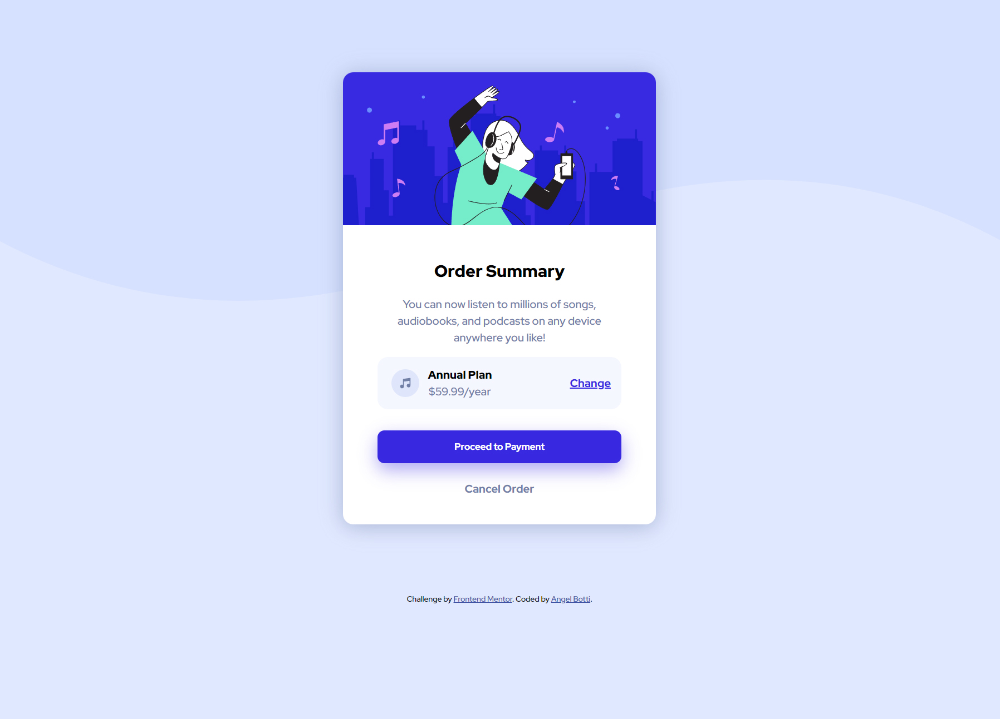
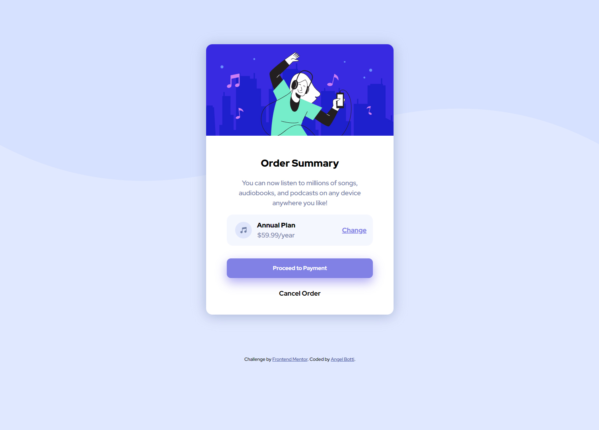

# Frontend Mentor - Order summary card solution

This is a solution to the [Order summary card challenge on Frontend Mentor](https://www.frontendmentor.io/challenges/order-summary-component-QlPmajDUj). Frontend Mentor challenges help you improve your coding skills by building realistic projects.

## Table of contents

- [Overview](#overview)
  - [The challenge](#the-challenge)
  - [Screenshot](#screenshot)
  - [Links](#links)
- [Author](#author)

## Overview

### The challenge

Users should be able to:

- See hover states for interactive elements

### Screenshot

Desktop view

Hover states

Mobile view

### Links

- Solution URL: [https://github.com/Botti13/Order-summary-card](https://github.com/Botti13/Order-summary-card)
- Live Site URL: [https://botti13.github.io/Order-summary-card/](https://botti13.github.io/Order-summary-card/)

## Author

- GitHub - [Botti13](https://github.com/Botti13)
- Frontend Mentor - [@Botti13](https://www.frontendmentor.io/profile/Botti13)
- LinkedIn - [Angel Botti](https://www.linkedin.com/in/angelbotti/)
